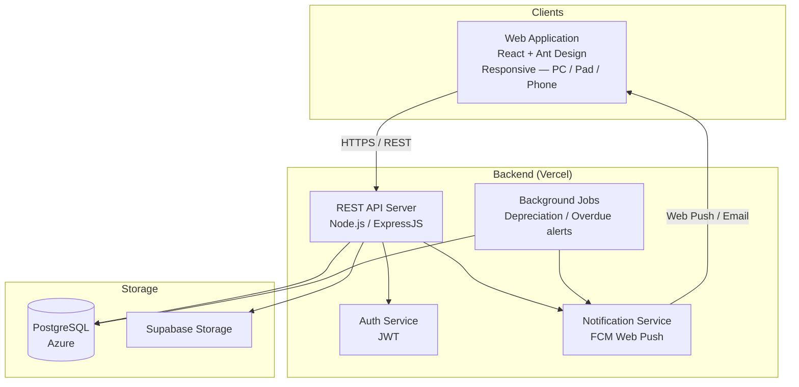
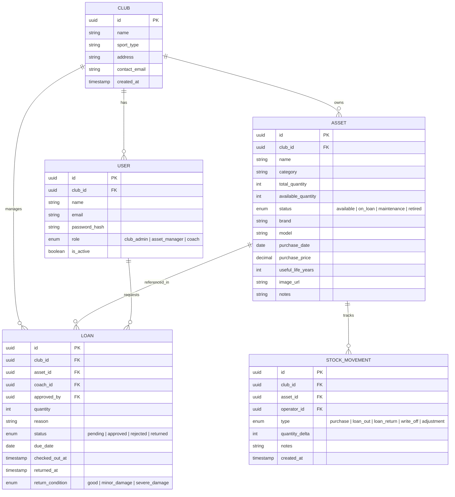
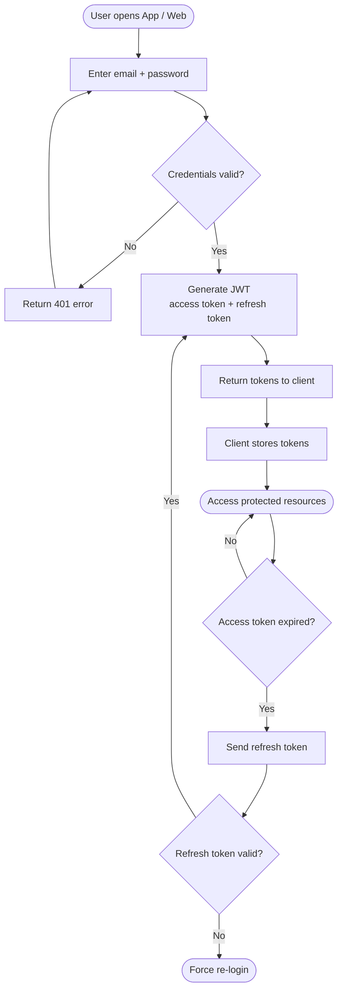
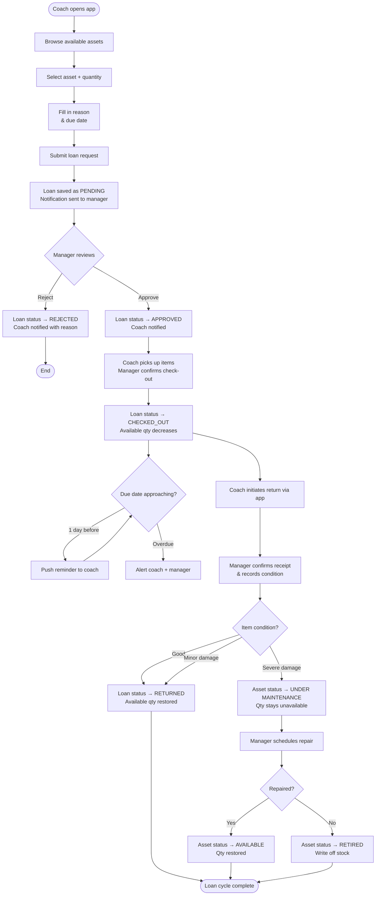
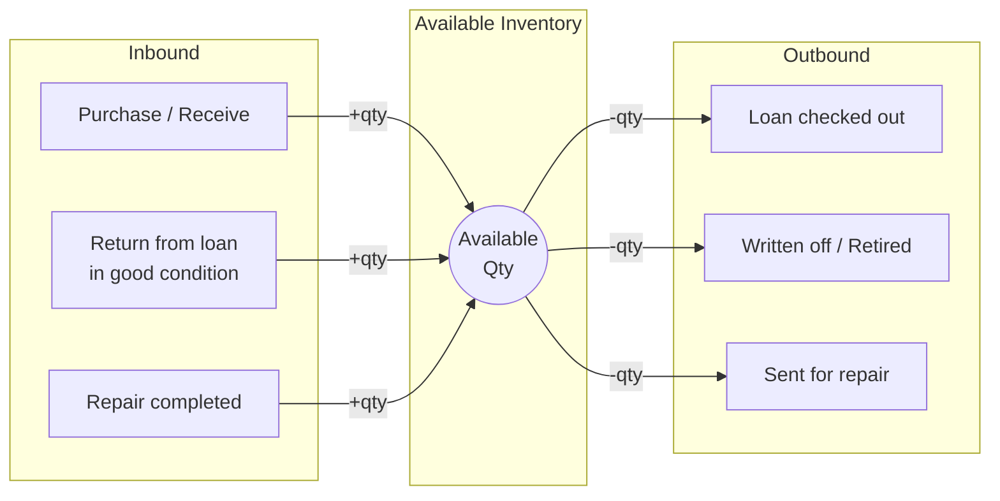
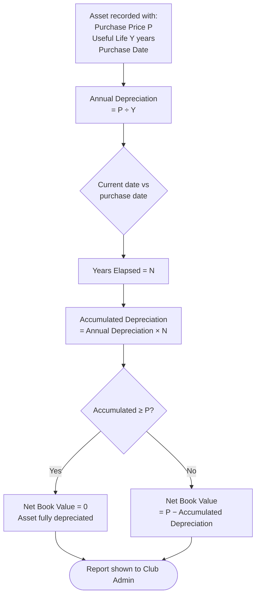

# SportStock — System Design

> Document Version: v1.0
> Created: 2026-04-04

---

## 1. System Overview

SportStock is a **multi-tenant SaaS platform** that digitalizes asset management for small youth sports clubs. It consists of a responsive web application and a backend API:

- **Web Application** — a single responsive web app serving all user roles (Club Admin, Asset Manager, Coach). The fluid layout adapts to PC, Pad, and Phone (iOS/Android browsers). No separate native mobile app.
- **Backend API** — RESTful service that enforces multi-tenant isolation and serves the web application

Each club is an independent **tenant**. Data is fully isolated — no club can access another's records.

---

## 2. System Architecture



---

## 3. Multi-Tenant Data Model

Each resource is scoped to a `club_id`, ensuring complete isolation between tenants.



---

## 4. Core Flow Charts

### 4.1 User Authentication Flow



---

### 4.2 Loan Request & Approval Flow



---

### 4.3 Asset Lifecycle


---

### 4.4 Inventory Stock Movement



---

### 4.5 Depreciation Calculation (Straight-Line Method)



---

## 5. API Design Principles

- **RESTful** — standard HTTP verbs (GET, POST, PUT, PATCH, DELETE)
- **Multi-tenant scoping** — all endpoints implicitly scoped to the authenticated user's `club_id`; no cross-club access possible
- **JWT auth** — Bearer token required on all protected routes
- **Versioning** — URL-based versioning (`/api/v1/...`)
- **Pagination** — all list endpoints support `page` + `limit` query params
- **Consistent error format**:
  ```json
  {
    "statusCode": 400,
    "error": "Bad Request",
    "message": "due_date must be a future date"
  }
  ```

### Key API Resource Groups

| Resource | Base Path | Notes |
|----------|-----------|-------|
| Auth | `/api/v1/auth` | Login, refresh token, logout |
| Clubs | `/api/v1/clubs` | Registration, profile |
| Users | `/api/v1/users` | Invite, role assignment, deactivate |
| Assets | `/api/v1/assets` | CRUD, bulk import, status update |
| Loans | `/api/v1/loans` | Request, approve/reject, check-out, return |
| Inventory | `/api/v1/inventory` | Stock movements, stocktake |
| Reports | `/api/v1/reports` | Financial summary, depreciation, usage stats |
| Notifications | `/api/v1/notifications` | List, mark as read |

---

## 6. Security Considerations

| Concern | Approach |
|---------|---------|
| Authentication | JWT (short-lived access token + refresh token rotation) |
| Authorization | Role-based access control (RBAC) enforced server-side |
| Tenant isolation | `club_id` injected from JWT claims — never trusted from request body |
| Transport security | HTTPS enforced on all endpoints |
| Sensitive operations | Audit log records who did what and when |
| Password storage | Bcrypt hashing with sufficient cost factor |

---

*This document will be updated as architecture decisions are confirmed and implementation progresses.*
