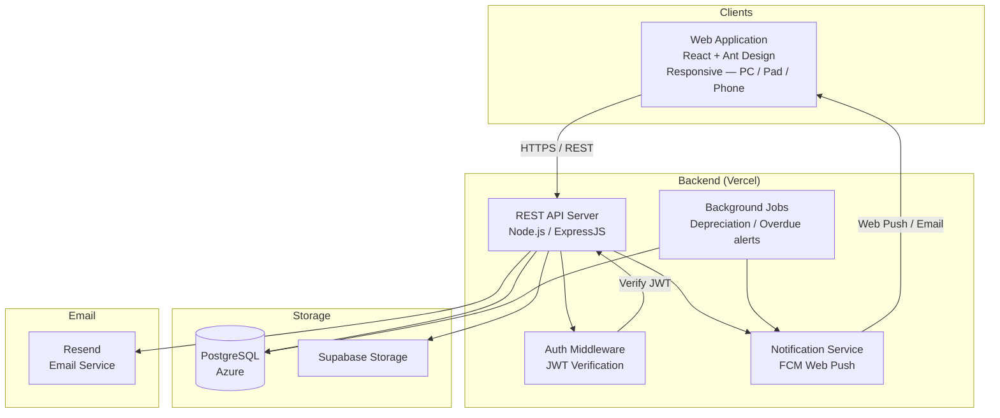
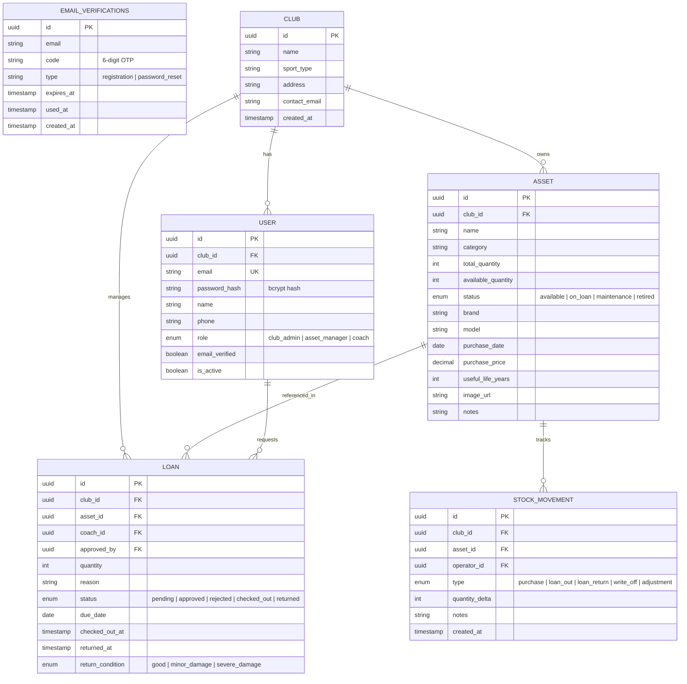
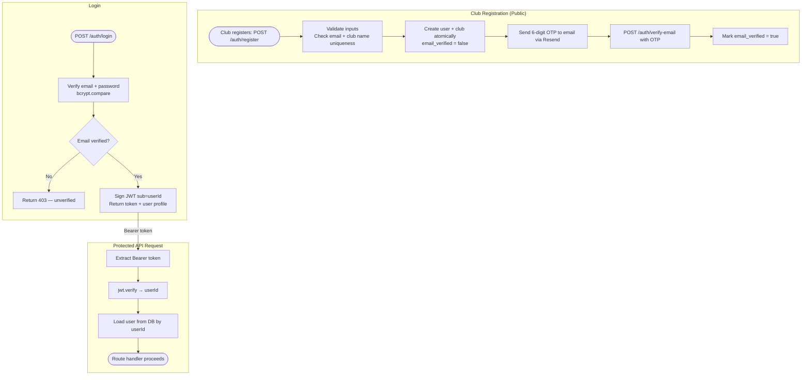
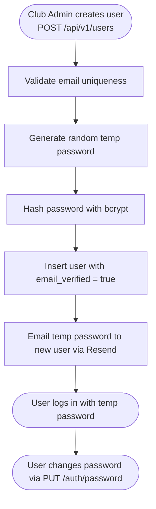
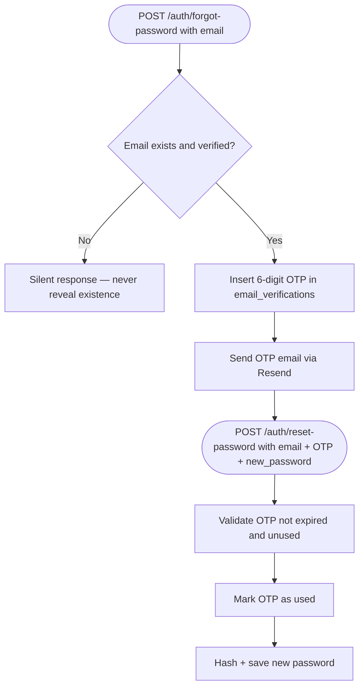
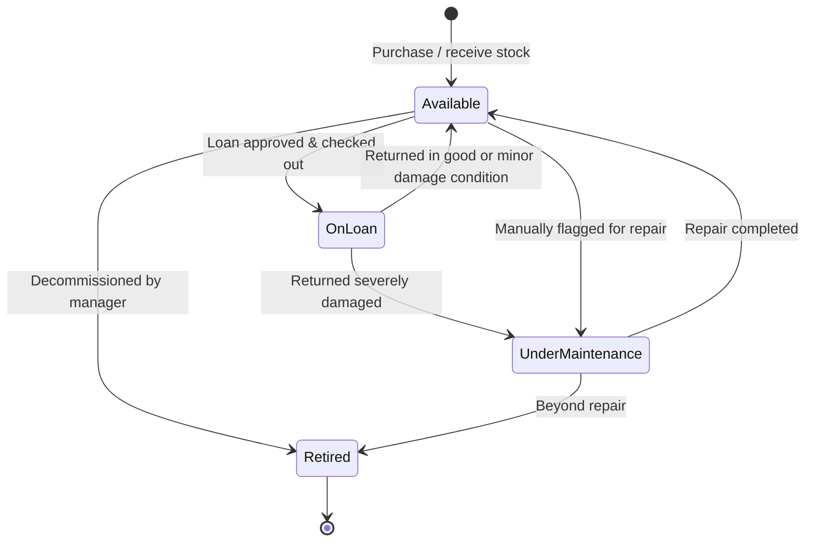
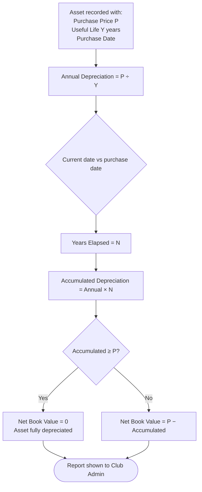

# SportStock — System Design

> Document Version: v2.0
> Updated: 2026-04-24

---

## 1. System Overview

SportStock is a **multi-tenant SaaS platform** that digitalizes asset management for small youth sports clubs. It consists of a responsive web application and a backend API:

- **Web Application** — a single responsive web app serving all user roles (Club Admin, Asset Manager, Coach). The fluid layout adapts to PC, Pad, and Phone (iOS/Android browsers). No separate native mobile app.
- **Backend API** — RESTful service that enforces multi-tenant isolation and serves the web application

Each club is an independent **tenant**. Data is fully isolated — no club can access another's records.

Authentication is **platform-owned**: users register with email + password, login returns a signed JWT. Email verification and password reset use OTP codes delivered via **Resend**. No external auth provider is used.

---

## 2. System Architecture



---

## 3. Multi-Tenant Data Model

Each resource is scoped to a `club_id`, ensuring complete isolation between tenants.



---

## 4. Core Flow Charts

### 4.1 User Authentication Flow

Authentication is fully owned by the platform. No external auth provider.



### 4.2 User Management Flow



### 4.3 Password Reset Flow



---

### 4.4 Loan Request & Approval Flow


---

### 4.5 Asset Lifecycle



---

### 4.6 Depreciation Calculation (Straight-Line Method)



---

## 5. API Design Principles

- **RESTful** — standard HTTP verbs (GET, POST, PUT, PATCH, DELETE)
- **Multi-tenant scoping** — all protected endpoints implicitly scoped to the authenticated user's `club_id`
- **JWT auth** — Bearer token required on all protected routes; issued by `POST /auth/login`
- **Versioning** — URL-based versioning (`/api/v1/...`)
- **Pagination** — all list endpoints support `page` + `limit` query params
- **Consistent error format**:
  ```json
  {
    "statusCode": 400,
    "error": "Bad Request",
    "message": "due_date must be a future date"
  }
  ```

### Key API Resource Groups

| Resource | Base Path | Auth | Notes |
|----------|-----------|------|-------|
| Auth (public) | `/api/v1/auth` | None | `POST /register`, `/login`, `/verify-email`, `/forgot-password`, `/reset-password` |
| Auth (protected) | `/api/v1/auth` | JWT | `GET /me`, `PUT /password` |
| Clubs | `/api/v1/clubs` | JWT | `GET /me`, `PUT /me`, `PUT /me/logo` |
| Users | `/api/v1/users` | JWT | CRUD; `POST /` (admin only — creates user directly) |
| Assets | `/api/v1/assets` | JWT | CRUD, categories, depreciation |
| Loans | `/api/v1/loans` | JWT | Request, approve/reject, check-out, return |
| Inventory | `/api/v1/inventory` | JWT | Stock movements, stocktake |
| Reports | `/api/v1/reports` | JWT | Financial summary, depreciation, usage stats |
| Notifications | `/api/v1/notifications` | JWT | List, mark as read, FCM tokens |

---

## 6. Security Considerations

| Concern | Approach |
|---------|---------|
| Authentication | Platform-owned JWT auth; `POST /auth/login` issues signed JWT |
| Password storage | bcrypt (10 rounds) — passwords never stored in plaintext |
| Email verification | 6-digit OTP via Resend, 15-minute expiry, single-use |
| Authorization | RBAC enforced server-side using `role` from user profile |
| Tenant isolation | `club_id` loaded from DB via JWT sub (userId) — never trusted from request body |
| Transport security | HTTPS enforced on all endpoints |
| Sensitive operations | Audit log records who did what and when |

---

## 7. Default Super Admin

A default platform super admin is created by running the seed script after initializing the schema:

```bash
npm run seed:admin
```

Default credentials: `admin@sportstock.com` / `Admin@SportStock2024`
**Change the password immediately after first login.**

---

*This document will be updated as architecture decisions are confirmed and implementation progresses.*
